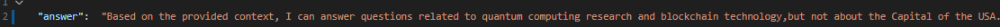
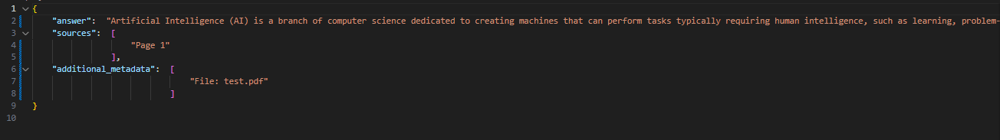

# oev-coding-task
# Retrieve-and-Generate (RAG) System

## Overview
This project implements a **Retrieve-and-Generate (RAG) system** that utilizes a **Language Model (LLM), a vector database (ChromaDB), and FastAPI** to answer queries based on a given document. The system relies **only on the provided document** (not the LLM's built-in knowledge) and retrieves relevant information from a **PDF file (`test.pdf`) and a JSON file (`test.json`).**


✅ **The system answers only from the provided documents and does not use external knowledge.**  


✅ **The response format strictly follows the requested JSON structure.** 


## Features
✅ Automatically ingests data from `test.pdf` and `test.json`  
✅ Uses **Hugging Face embeddings** (`sentence-transformers/all-mpnet-base-v2`)  
✅ Stores and retrieves data using **ChromaDB**  
✅ Exposes a **REST API** via FastAPI for querying  
✅ Splits documents into **manageable chunks** for efficient retrieval  
✅ Returns answers with **relevant page numbers and metadata**  

## Tech Stack
- **Language Model**:  (integrated via Groq API)
- **Embeddings**: `sentence-transformers/all-mpnet-base-v2`
- **Vector Database**: ChromaDB
- **API Framework**: FastAPI
- **PDF Processing**: PyMuPDF
- **JSON Parsing**: Python `json` module
- **Environment**:Vs code (Python 3.12)

## Installation
Ensure you have Python 3.12+ installed, then set up your environment:

```sh
# Clone the repository
git clone https://github.com/Omkar-Gavali/oev-coding-task.git
cd your-repo

# Create and activate virtual environment
python -m venv venv
source venv/bin/activate  # On Windows use 'venv\Scripts\activate'

# Install dependencies
pip install -r requirements.txt


## API Usage

### **Query API**
Retrieve answers based on `test.pdf` and `test.json`.

#### **Request**
```sh
curl -X 'GET' 'http://127.0.0.1:8000/query?question=What is in the document?' -H 'accept: application/json'
